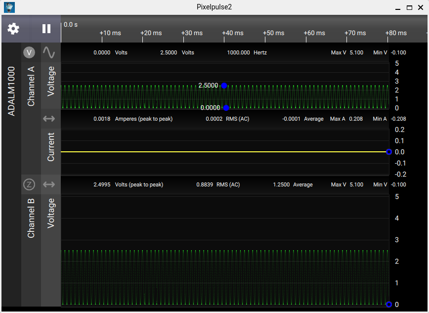

# Common Issues with Fixes

## Improper Rendering

If your top bar is broken or you see any other similar UI issues, try forcing xcb rendering while running the app:

```bash
QT_QPA_PLATFORM=xcb ./Pixelpulse2-test-anylinux-*.AppImage
``` 


Before:



After:


Now, the app renders correctly and respects OS theming 